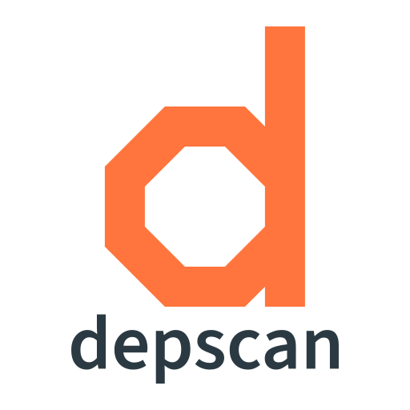
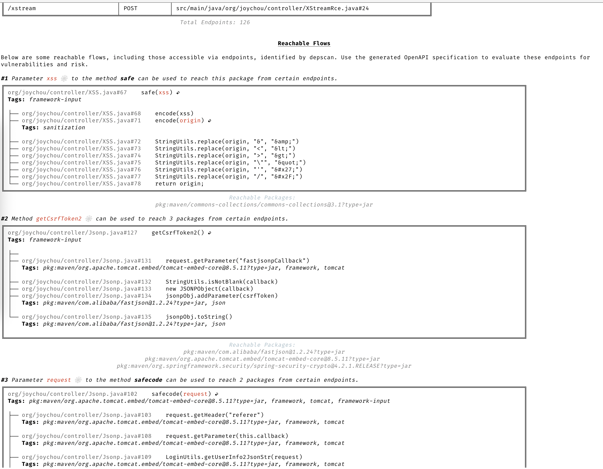
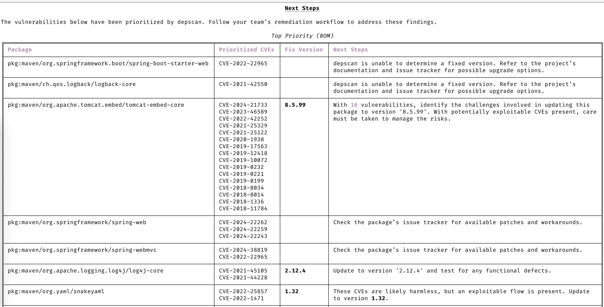
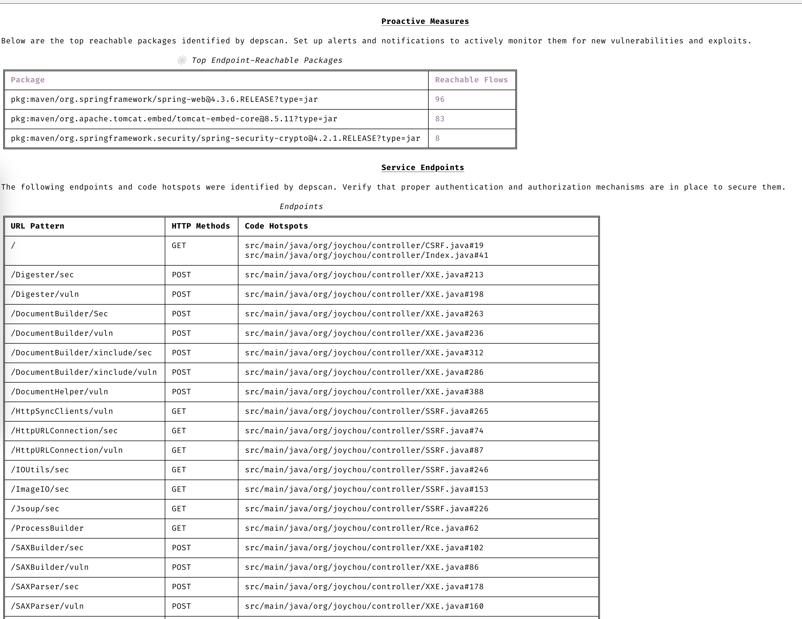

# Introduction

OWASP dep-scan is a next-generation security and risk audit tool based on known vulnerabilities, advisories, and license limitations for project dependencies. Both local repositories and container images are supported as the input, and the tool is ideal for integration with ASPM/VM platforms and in CI environments.



[](https://github.com/owasp-dep-scan/dep-scan/actions/workflows/pythonpublish.yml)

## Contents

- [Features](#features)
    - [Vulnerability Data sources](#vulnerability-data-sources)
    - [Linux distros](#linux-distros)
- [Quick Start](#quick-start)
    - [Scanning projects locally (Python version)](#scanning-projects-locally-python-version)
    - [Scanning containers locally (Python version)](#scanning-containers-locally-python-version)
    - [Scanning projects locally (Docker container)](#scanning-projects-locally-docker-container)
    - [Server mode](#server-mode)
- [depscanGPT](https://chatgpt.com/g/g-674f260c887c819194e465d2c65f4061-owasp-dep-scan)
- [Documentation (depscan.readthedocs.io)](https://depscan.readthedocs.io)
    - [Supported languages and package format](https://depscan.readthedocs.io/supported-languages)
    - [Reachability analysis](https://depscan.readthedocs.io/reachability-analysis)
        - [Example analysis for a Java project](https://depscan.readthedocs.io/reachability-analysis#example-analysis-for-a-java-project)
        - [Example analysis for a JavaScript project](https://depscan.readthedocs.io/reachability-analysis#example-analysis-for-a-java-project)
    - [Customization through environment variables](https://depscan.readthedocs.io/env-var#customization-through-environment-variables)
    - [GitHub Security Advisory](https://depscan.readthedocs.io/adv-usage#github-security-advisory)
    - [Suggest mode](https://depscan.readthedocs.io/adv-usage#suggest-mode)
    - [Package Risk audit](https://depscan.readthedocs.io/adv-usage#package-risk-audit)
        - [Automatic adjustment](https://depscan.readthedocs.io/adv-usage#automatic-adjustment)
        - [Configuring weights](https://depscan.readthedocs.io/adv-usage#configuring-weights)
    - [Live OS scan](https://depscan.readthedocs.io/adv-usage#live-os-scan)
    - [License scan](https://depscan.readthedocs.io/adv-usage#license-scan)
    - [Kubernetes and Cloud apps](https://depscan.readthedocs.io/adv-usage#kubernetes-and-cloud-apps)
    - [PDF reports](https://depscan.readthedocs.io/adv-usage#pdf-reports)
    - [Custom reports](https://depscan.readthedocs.io/adv-usage#custom-reports)
- [License](#license)

## Features

- Scan most application code - local repos, Linux container images, Kubernetes manifests, and OS - to identify known CVEs with prioritization
- Perform advanced reachability analysis for multiple languages (See reachability analysis)
- Package vulnerability scanning is performed locally and is quite fast. No server is used!
- Generate Software Bill-of-Materials (SBOM) with Vulnerability Disclosure Report (VDR) information
- Generate a Common Security Advisory Framework (CSAF) 2.0 VEX document (check out the [CSAF Readme](contrib/CSAF_README.md))
- Perform deep packages risk audit for dependency confusion attacks and maintenance risks (See risk audit)

### Precise Reachable data-flows

Detailed data flows to identify both reachable and non-reachable paths in your application based on the full context.



### Clear insights about CVEs

Understand CVEs clearly without having to read through the description.


### Automatic prioritization

Only focus on CVEs that need your attention.



### Stay proactive

Always stay a step ahead with advanced vulnerability and exploit prediction.



### Vulnerability Data sources

- OSV
- NVD
- GitHub
- NPM
- Linux [vuln-list](https://github.com/appthreat/vuln-list)

### Linux distros

- AlmaLinux
- Debian
- Alpine
- Amazon Linux
- Arch Linux
- RHEL/CentOS
- Rocky Linux
- Ubuntu
- OpenSUSE/SLES
- Photon
- Chainguard
- Wolfi OS

## Quick Start

dep-scan is ideal for use during continuous integration (CI) and as a local development tool.

### Scanning projects locally (Python version)

```bash
sudo npm install -g @cyclonedx/cdxgen
# Normal version recommended for most users (MIT)
pip install owasp-depscan

# For a full version with all extensions and server mode (Multiple Licenses)
pip install owasp-depscan[all]
```

This would install two commands called `cdxgen` and `depscan`.

You can invoke the scan command directly with the various options.

```bash
cd <project to scan>
depscan --src $PWD --reports-dir $PWD/reports
```

The full list of options is below:

```text
usage: depscan [-h] [--config CONFIG] [--no-banner] [-i SRC_DIR_IMAGE] [-o REPORTS_DIR] [--csaf]
               [--profile {appsec,research,operational,threat-modeling,license-compliance,generic,machine-learning,ml,deep-learning,ml-deep,ml-tiny}]
               [--lifecycle {pre-build,build,post-build} [{pre-build,build,post-build} ...]]
               [--technique {auto,source-code-analysis,binary-analysis,manifest-analysis,hash-comparison,instrumentation,filename} [{auto,source-code-analysis,binary-analysis,manifest-analysis,hash-comparison,instrumentation,filename} ...]]
               [--bom-engine {auto,CdxgenGenerator,CdxgenServerGenerator,CdxgenImageBasedGenerator,BlintGenerator} |
               --vulnerability-analyzer {auto,VDRAnalyzer,LifecycleAnalyzer}] [--reachability-analyzer {off,FrameworkReachability,SemanticReachability}] [--no-suggest]
               [--risk-audit] [--cdxgen-args CDXGEN_ARGS] [--private-ns PRIVATE_NS] [-t PROJECT_TYPE [PROJECT_TYPE ...]] [--bom BOM | --bom-dir BOM_DIR | --purl SEARCH_PURL]
               [--report-template REPORT_TEMPLATE] [--report-name REPORT_NAME] [--deep] [--fuzzy-search] [--search-order {purl,pcu,cpe,cpu,url}] [--no-universal]
               [--no-vuln-table] [--server] [--server-host SERVER_HOST] [--server-port SERVER_PORT] [--cdxgen-server CDXGEN_SERVER] [--debug] [-q | --explain] [-v]

Fully open-source security and license audit for application dependencies and container images based on known vulnerabilities and advisories.

options:
  -h, --help            show this help message and exit
  --config CONFIG       Path to the configuration file. Default: $PWD/.config/depscan.toml
  --no-banner           Do not display the logo and donation banner. Please make a donation to OWASP before using this argument.
  -i, --src SRC_DIR_IMAGE
                        Source directory or container image or binary file
  -o, --reports-dir REPORTS_DIR
                        Reports directory
  --csaf                Generate a OASIS CSAF VEX document
  --profile {appsec,research,operational,threat-modeling,license-compliance,generic,machine-learning,ml,deep-learning,ml-deep,ml-tiny}
                        Profile to use while generating the BOM. For granular control, use the arguments --bom-engine, --vulnerability-analyzer, or --reachability-analyzer.
  --lifecycle {pre-build,build,post-build} [{pre-build,build,post-build} ...]
                        Product lifecycle for the generated BOM. Multiple values allowed.
  --technique {auto,source-code-analysis,binary-analysis,manifest-analysis,hash-comparison,instrumentation,filename} [{auto,source-code-analysis,binary-analysis,manifest-analysis,hash-comparison,instrumentation,filename} ...]
                        Analysis technique to use for BOM generation. Multiple values allowed.
  --bom-engine {auto,CdxgenGenerator,CdxgenServerGenerator,CdxgenImageBasedGenerator,BlintGenerator}
                        BOM generation engine to use. Defaults to automatic selection based on project type and lifecycle.
  --vulnerability-analyzer {auto,VDRAnalyzer,LifecycleAnalyzer}
                        Vulnerability analyzer to use. Defaults to automatic selection based on bom_dir argument.
  --reachability-analyzer {off,FrameworkReachability,SemanticReachability}
                        Reachability analyzer to use. Default FrameworkReachability.
  --no-suggest          Disable suggest mode
  --risk-audit          Perform package risk audit (slow operation). Npm only.
  --cdxgen-args CDXGEN_ARGS
                        Additional arguments to pass to cdxgen
  --private-ns PRIVATE_NS
                        Private namespace to use while performing oss risk audit. Private packages should not be available in public registries by default. Comma separated
                        values accepted.
  -t, --type PROJECT_TYPE [PROJECT_TYPE ...]
                        Override project types if auto-detection is incorrect. Multiple values supported.
  --bom BOM             Examine using the given Software Bill-of-Materials (SBOM) file in CycloneDX format. Use cdxgen command to produce one.
  --bom-dir BOM_DIR     Examine all the Bill-of-Materials (BOM) files in the given directory.
  --purl SEARCH_PURL    Scan a single package url.
  --report-template REPORT_TEMPLATE
                        Jinja template file used for rendering a custom report
  --report-name REPORT_NAME
                        Filename of the custom report written to the --reports-dir
  --deep                Perform deep scan by passing this --deep argument to cdxgen. Useful while scanning docker images and OS packages.
  --fuzzy-search        Perform fuzzy search by creating variations of package names. Use this when the input SBOM lacks a PURL.
  --search-order {purl,pcu,cpe,cpu,url}
                        Attributes to use while searching for vulnerabilities. Default: PURL, CPE, URL (pcu).
  --no-universal        Depscan would attempt to perform a single universal scan instead of individual scans per language type.
  --no-vuln-table       Do not print the table with the full list of vulnerabilities. This can help reduce console output.
  --server              Run depscan as a server
  --server-host SERVER_HOST
                        depscan server host
  --server-port SERVER_PORT
                        depscan server port
  --server-allowed-hosts [SERVER_ALLOWED_HOSTS ...]
                        List of allowed hostnames or IPs that can access the server (e.g., 'localhost 192.168.1.10'). If unspecified, no host allowlist is
                        enforced.
  --server-allowed-paths [SERVER_ALLOWED_PATHS ...]
                        List of allowed filesystem paths that can be scanned by the server. Restricts `path` parameter in /scan requests.
  --cdxgen-server CDXGEN_SERVER
                        cdxgen server url. Eg: http://cdxgen:9090
  --debug               Run depscan in debug mode.
  -q, --quiet           Makes depscan quiet.
  --explain             Makes depscan to explain the various analysis. Useful for creating detailed reports.
  --explanation-mode {Endpoints,EndpointsAndReachables,NonReachables}
                        Style of explanation needed. Defaults to Endpoints and Reachables.
  --annotate            Include the generated text VDR report as an annotation. Defaults to true when explain is enabled; false otherwise.
  -v, --version         Display the version
```

### Scanning containers locally (Python version)

Scan a Java project.

```bash
depscan --src <path> -o containertests -t java
```

Scan `latest` tag of the container `shiftleft/scan-slim`

```bash
depscan --src shiftleft/scan-slim -o containertests -t docker
```

Include `license` to the type to perform the license audit.

```bash
depscan --src shiftleft/scan-slim -o containertests -t docker license
```

You can also specify the image using the sha256 digest

```bash
depscan --src redmine@sha256:a5c5f8a64a0d9a436a0a6941bc3fb156be0c89996add834fe33b66ebeed2439e -o containertests -t docker
```

You can also save container images using docker or podman save command and pass the archive to depscan for scanning.

```bash
docker save -o /tmp/scanslim.tar shiftleft/scan-slim:latest
# podman save --format oci-archive -o /tmp/scanslim.tar shiftleft/scan-slim:latest
depscan --src /tmp/scanslim.tar -o reports -t docker
```

Refer to the docker tests under the GitHub action workflow for this repo for more examples.

### Scanning projects locally (Docker container)

`ghcr.io/owasp-dep-scan/dep-scan` container image can be used to perform the scan.

To scan with default settings

```bash
docker run --rm -v $PWD:/app ghcr.io/owasp-dep-scan/dep-scan depscan --src /app --reports-dir /app/reports
```

To scan with custom environment variables based configuration

```bash
docker run --rm \
    -e VDB_HOME=/db \
    -e GITHUB_TOKEN=<token> \
    -v /tmp:/db \
    -v $PWD:/app ghcr.io/owasp-dep-scan/dep-scan depscan --src /app --reports-dir /app/reports
```

In the above example, `/tmp` is mounted as `/db` into the container. This directory is then specified as `VDB_HOME` for caching the vulnerability information. This way the database can be cached and reused to improve performance.

### Server mode

dep-scan and cdxgen could be run in server mode. Use the included docker-compose file to get started.

```bash
git clone https://github.com/owasp-dep-scan/dep-scan
docker compose up
```

```bash
depscan --server --server-host 0.0.0.0 --server-port 7070
```

Use the `/scan` endpoint to perform scans.

> [!NOTE]
> The `type` parameter is mandatory in server mode.

- Scanning a local directory.
  Scanning an SBOM file (present locally).

```bash
curl --json '{"path": "/tmp/vulnerable-aws-koa-app/sbom_file.json", "type": "js"}' http://0.0.0.0:7070/scan
```

- Scanning a GitHub repo.

```bash
curl --json '{"url": "https://github.com/HooliCorp/vulnerable-aws-koa-app", "type": "js"}' http://0.0.0.0:7070/scan -o app.vdr.json
```

- Uploading an SBOM file and generating results based on it.

```bash
curl -X POST -H 'Content-Type: multipart/form-data' -F 'file=@/tmp/app/sbom_file.json' http://0.0.0.0:7070/scan?type=js
```

## Local development

Setup uv by following the official [documentation](https://docs.astral.sh/uv/).

```shell
uv sync --all-extras --all-packages
uv run depscan --help
uv run pytest
```

### Local VDB setup

```shell
vdb --clean
vdb --download-image
# To scan containers and OS images
# vdb --download-full-image
```

### Scan local depscan

```shell
uv run depscan --config .config/depscan-dev.toml
```

This would automatically use the configuration specified in the local config [file](./.config/depscan.toml).

## License

MIT License

This project was donated to the OWASP Foundation in August 2023 by AppThreat Ltd.

## Funding

This project is funded through [NGI Zero Core](https://nlnet.nl/core), a fund established by [NLnet](https://nlnet.nl) with financial support from the European Commission's [Next Generation Internet](https://ngi.eu) program. Learn more at the [NLnet project page](https://nlnet.nl/project/OWASP-dep-scan).

[](https://nlnet.nl)
[](https://nlnet.nl/core)
