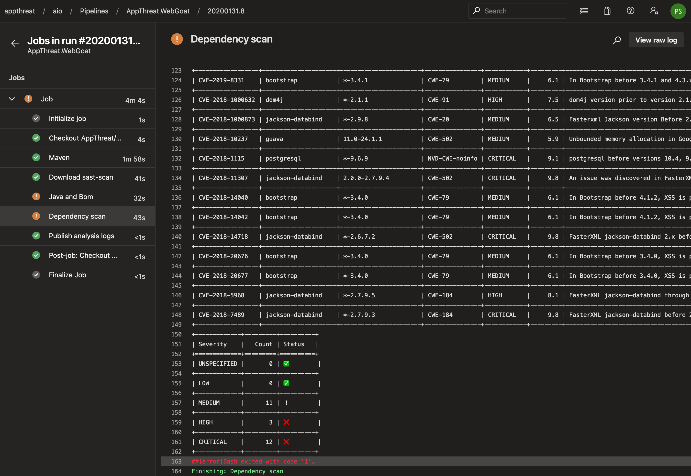
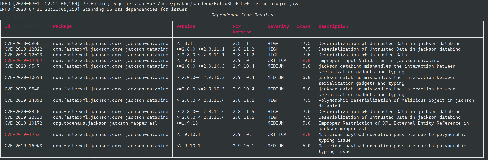

# Introduction

dep-scan is a fully open-source security audit tool based on known vulnerabilities, advisories, and license limitations for project dependencies. Both local repositories and container images are supported as the input, and the tool is ideal for CI environments with built-in build-breaker logic.


## Features

- Scan most application code - local repos, Linux container images, Kubernetes manifests, and OS - to identify known CVEs with prioritization
- Package vulnerability scanning is performed locally and is quite fast. No server is used!
- Generate Software Bill-of-Materials (SBoM) with Vulnerability Exploitability Exchange (VEX) information
- Perform deep packages risk audit for dependency confusion attacks and maintenance risks (See risk audit)


### Vulnerability Data sources

- OSV
- NVD
- GitHub
- NPM
- Linux [vuln-list](https://github.com/appthreat/vuln-list) (Use `--cache-os`)

### Linux distros

- AlmaLinux
- Debian
- Alpine
- Amazon Linux
- Arch Linux
- RHEL/CentOS
- Rocky Linux
- Ubuntu
- OpenSUSE/SLES
- Photon

Application vulnerabilities would be reported for all Linux distros and Windows. To download the full vulnerability database suitable for scanning OS, invoke dep-scan with `--cache-os` for the first time. dep-scan would also download the appropriate database based on project type automatically.

## Usage

dep-scan is ideal for use during continuous integration (CI) and as a local development tool.

### OCI Artifacts via ORAS cli

Use [ORAS cli](https://oras.land/cli/) to download the dep-scan binary and the vulnerability database for effortless integration. Example workflow is [here](https://github.com/appthreat/images-info/blob/main/.github/workflows/build.yml#L13).

```bash
export VDB_HOME=depscan
mkdir -p $VDB_HOME
oras pull ghcr.io/appthreat/vdb:v5 -o $VDB_HOME
oras pull ghcr.io/appthreat/depscan:v4 -o $VDB_HOME
```

### Single binary executables

Download the executable binary for your operating system from the [releases page](https://github.com/appthreat/depscan-bin/releases). These binary bundle the following:

- dep-scan with Python 3.10
- cdxgen with Node.js 18
- cdxgen binary plugins

```bash
curl -LO https://github.com/appthreat/depscan-bin/releases/download/v3.5.1/depscan-linux-amd64
chmod +x depscan-linux-amd64
./depscan-linux-amd64 --help
```

On Windows,

```powershell
curl -LO https://github.com/appthreat/depscan-bin/releases/download/v3.5.1/depscan.exe
.\depscan.exe --help
```

### Server mode

dep-scan and cdxgen could be run in server mode. Use the included docker compose file to get started.

```bash
git clone https://github.com/AppThreat/dep-scan
docker compose up
```

```bash
depscan --server --server-host 0.0.0.0 --server-port 7070
```

In server mode, use `/cache` endpoint to cache the vulnerability database.

```bash
# This would take over 5 minutes
curl http://0.0.0.0:7070/cache
```

Cache all vulnerabilities including os.

```bash
# This would take over 5 minutes
curl http://0.0.0.0:7070/cache?os=true
```

Use the `/scan` endpoint to perform scans.

```bash
curl --json '{"path": "/tmp/vulnerable-aws-koa-app", "type": "js"}' http://0.0.0.0:7070/scan
```

```bash
curl --json '{"url": "https://github.com/HooliCorp/vulnerable-aws-koa-app", "type": "js"}' http://0.0.0.0:7070/scan -o app.vex.json
```

### Use with ShiftLeft Scan

dep-scan is integrated with [scan](https://github.com/ShiftLeftSecurity/sast-scan), a free and open-source SAST tool. To enable this feature simply pass `depscan` to the `--type` argument. [Refer](https://slscan.io) to the scan documentation for more information.

```yaml
---
--type python,depscan,credscan
```

This approach should work for all CI environments supported by scan.

### Scanning projects locally (Python version)

```bash
sudo npm install -g @cyclonedx/cdxgen
pip install appthreat-depscan
```

This would install two commands called `cdxgen` and `scan`.

You can invoke the scan command directly with the various options.

```bash
cd <project to scan>
depscan --src $PWD --reports-dir $PWD/reports
```

Full list of options are below:

```bash
usage: depscan [-h] [--no-banner] [--cache] [--cache-os] [--sync] [--suggest] [--risk-audit] [--private-ns PRIVATE_NS] [-t PROJECT_TYPE] [--bom BOM] -i SRC_DIR
              [--reports-dir REPORTS_DIR] [--no-error] [--deep]
  -h, --help            show this help message and exit
  --no-banner           Do not display banner
  --cache               Cache vulnerability information in platform specific user_data_dir
  --cache-os            Cache OS vulnerability information in platform specific user_data_dir
  --sync                Sync to receive the latest vulnerability data. Should have invoked cache first.
  --risk-audit          Perform package risk audit (slow operation). Npm only.
  --private-ns PRIVATE_NS
                        Private namespace to use while performing oss risk audit. Private packages should not be available in public registries by default. Comma
                        separated values accepted.
  -t PROJECT_TYPE, --type PROJECT_TYPE
                        Override project type if auto-detection is incorrect
  --bom BOM             Examine using the given Software Bill-of-Materials (SBoM) file in CycloneDX format. Use cdxgen command to produce one.
  -i SRC_DIR, --src SRC_DIR
                        Source directory
  --reports-dir REPORTS_DIR
                        Reports directory
  --no-error            Continue on error to prevent build from breaking
  --deep                Perform deep scan by passing this --deep argument to cdxgen. Useful while scanning docker images and OS packages.
  --no-universal        Depscan would attempt to perform a single universal scan instead of individual scans per language type.
  --no-vuln-table       Do not print the table with the full list of vulnerabilities. This can help reduce console output.
  --threatdb-server THREATDB_SERVER
                        ThreatDB server url. Eg: https://api.sbom.cx
  --threatdb-username THREATDB_USERNAME
                        ThreatDB username
  --threatdb-password THREATDB_PASSWORD
                        ThreatDB password
  --threatdb-token THREATDB_TOKEN
                        ThreatDB token for token based submission
  --privado-json PRIVADO_JSON
                        Enrich the VEX report with information from privado.ai json report.
```

### Scanning containers locally (Python version)

Scan `latest` tag of the container `shiftleft/scan-slim`

```bash
depscan --no-error --cache --src shiftleft/scan-slim -o containertests/depscan-scan.json -t docker
```

Include `license` to the type to perform license audit.

```bash
depscan --no-error --cache --src shiftleft/scan-slim -o containertests/depscan-scan.json -t docker,license
```

You can also specify the image using the sha256 digest

```bash
depscan --no-error --src redmine@sha256:a5c5f8a64a0d9a436a0a6941bc3fb156be0c89996add834fe33b66ebeed2439e -o containertests/depscan-redmine.json -t docker
```

You can also save container images using docker or podman save command and pass the archive to depscan for scanning.

```bash
docker save -o /tmp/scanslim.tar shiftleft/scan-slim:latest
# podman save --format oci-archive -o /tmp/scanslim.tar shiftleft/scan-slim:latest
depscan --no-error --src /tmp/scanslim.tar -o reports/depscan-scan.json -t docker
```

Refer to the docker tests under GitHub action workflow for this repo for more examples.

### Scanning projects locally (Docker container)

`ghcr.io/appthreat/dep-scan` or `public.ecr.aws/appthreat/dep-scan:latest` container image can be used to perform the scan.

To scan with default settings

```bash
docker run --rm -v $PWD:/app ghcr.io/appthreat/dep-scan scan --src /app --reports-dir /app/reports
```

Using AWS public ECR image

```bash
docker run --rm -v $PWD:/app public.ecr.aws/appthreat/dep-scan scan --src /app --reports-dir /app/reports
```

To scan with custom environment variables based configuration

```bash
docker run --rm \
    -e VDB_HOME=/db \
    -e NVD_START_YEAR=2010 \
    -e GITHUB_PAGE_COUNT=5 \
    -e GITHUB_TOKEN=<token> \
    -v /tmp:/db \
    -v $PWD:/app ghcr.io/appthreat/dep-scan scan --src /app --reports-dir /app/reports
```

In the above example, `/tmp` is mounted as `/db` into the container. This directory is then specified as `VDB_HOME` for caching the vulnerability information. This way the database can be cached and reused to improve performance.

## Supported languages and package format

dep-scan uses [cdxgen](https://github.com/CycloneDX/cdxgen) command internally to create Software Bill-of-Materials (SBoM) file for the project. This is then used for performing the scans.

The following projects and package-dependency format is supported by cdxgen.

| Language                 | Package format                                                                          |
| ------------------------ | --------------------------------------------------------------------------------------- |
| node.js                  | package-lock.json, pnpm-lock.yaml, yarn.lock, rush.js, bower.json, .min.js              |
| java                     | maven (pom.xml [1]), gradle (build.gradle, .kts), scala (sbt), bazel                    |
| php                      | composer.lock                                                                           |
| python                   | setup.py, requirements.txt [2], Pipfile.lock, poetry.lock, bdist_wheel, .whl, .egg-info |
| go                       | binary, go.mod, go.sum, Gopkg.lock                                                      |
| ruby                     | Gemfile.lock, gemspec                                                                   |
| rust                     | binary, Cargo.toml, Cargo.lock                                                          |
| .Net                     | .csproj, packages.config, project.assets.json [3], packages.lock.json, .nupkg           |
| dart                     | pubspec.lock, pubspec.yaml                                                              |
| haskell                  | cabal.project.freeze                                                                    |
| elixir                   | mix.lock                                                                                |
| c/c++                    | conan.lock, conanfile.txt                                                               |
| clojure                  | Clojure CLI (deps.edn), Leiningen (project.clj)                                         |
| docker / oci image       | All supported languages and Linux OS packages                                           |
| GitHub Actions Workflows | .github/workflows/\*.yml                                                                |
| Jenkins Plugins          | .hpi files                                                                              |
| YAML manifests           | docker-compose, kubernetes, kustomization, skaffold, tekton etc                         |

**NOTE**

The docker image for dep-scan currently doesn't bundle suitable java and maven commands required for bom generation. To workaround this limitation, you can -

1. Use python-based execution from a VM containing the correct versions for java, maven and gradle.
2. Generate the bom file by invoking `cdxgen` command locally and subsequently passing this to `dep-scan` via the `--bom` argument.

## Integration with CI environments

### Integration with Azure DevOps

Refer to [this example yaml](https://github.com/AppThreat/WebGoat/blob/develop/azure-pipelines.yml#L33) configuration for integrating dep-scan with Azure Pipelines. The build step would perform the scan and display the report inline as shown below:



### Integration with GitHub Actions

This tool can be used with GitHub Actions using this [action](https://github.com/marketplace/actions/dep-scan).

This repo self-tests itself with both sast-scan and dep-scan! Check the GitHub [workflow file](https://github.com/AppThreat/dep-scan/blob/master/.github/workflows/pythonapp.yml) of this repo.

```yaml
- name: Self dep-scan
  uses: AppThreat/dep-scan-action@master
  env:
    VDB_HOME: ${{ github.workspace }}/db
    GITHUB_TOKEN: ${{ secrets.GITHUB_TOKEN }}
```

## Customization through environment variables

The following environment variables can be used to customise the behaviour.

- VDB_HOME - Directory to use for caching database. For docker based execution, this directory should get mounted as a volume from the host
- NVD_START_YEAR - Default: 2018. Supports upto 2002
- GITHUB_PAGE_COUNT - Default: 2. Supports upto 20

## GitHub Security Advisory

To download security advisories from GitHub, a personal access token with the following scope is necessary.

- read:packages

```bash
export GITHUB_TOKEN="<PAT token>"
```

## Suggest mode

Fix version for each vulnerability is retrieved from the sources. Sometimes, there might be known vulnerabilities in the fix version reported. Eg: in the below screenshot the fix versions suggested for jackson-databind might contain known vulnerabilities.



By passing an argument `--suggest` it is possible to force depscan to recheck the fix suggestions. This way the suggestion becomes more optimal for a given package group.


Notice, how the new suggested version is `2.9.10.5` which is an optimal fix version. Please note that the optimal fix version may not be the appropriate version for your application based on compatibility.

## Package Risk audit

`--risk-audit` argument enables package risk audit. Currently, only npm and pypi packages are supported in this mode. A number of risk factors are identified and assigned weights to compute a final risk score. Packages that then exceed a maximum risk score (`config.pkg_max_risk_score`) are presented in a table.

Use `--private-ns` to specify the private package namespace that should be checked for dependency confusion type issues where a private package is available on public npm/pypi registry.

For example, to check if private packages with namespaces @appthreat and @shiftleft are not accidentally made public, use the below argument.

```
--private-ns appthreat,shiftleft
```

| Risk category                  | Default Weight | Reason                                                                                                                                                                                                     |
| ------------------------------ | -------------- | ---------------------------------------------------------------------------------------------------------------------------------------------------------------------------------------------------------- |
| pkg_private_on_public_registry | 4              | Private package is available on a public registry                                                                                                                                                          |
| pkg_min_versions               | 2              | Packages with less than 3 versions represent an extreme where they could be either super stable or quite recent. Special heuristics are applied to ignore older stable packages                            |
| mod_create_min_seconds         | 1              | Less than 12 hours difference between modified and creation time. This indicates that the upload had a defect that had to be rectified immediately. Sometimes, such a rapid update could also be malicious |
| latest_now_min_seconds         | 0.5            | Less than 12 hours difference between the latest version and the current time. Depending on the package such a latest version may or may not be desirable                                                  |
| latest_now_max_seconds         | 0.5            | Package versions that are over 6 years old are in use. Such packages might have vulnerable dependencies that are known or yet to be found                                                                  |
| pkg_min_maintainers            | 2              | Package has less than 2 maintainers. Many opensource projects have only 1 or 2 maintainers so special heuristics are used to ignore older stable packages                                                  |
| pkg_min_users                  | 0.25           | Package has less than 2 npm users                                                                                                                                                                          |
| pkg_install_scripts            | 2              | Package runs a custom pre or post installation scripts. This is often malicious and a downside of npm.                                                                                                     |
| pkg_node_version               | 0.5            | Package supports outdated version of node such as 0.8, 0.10, 4 or 6.x. Such projects might have prototype pollution or closure related vulnerabilities                                                     |
| pkg_scope                      | 4 or 0.5       | Packages that are used directly in the application (required scope) gets a score with a weight of 4. Optional packages get a score of 0.25                                                                 |
| deprecated                     | 1              | Latest version is deprecated                                                                                                                                                                               |

Refer to `pkg_query.py::get_category_score` method for the risk formula.

### Automatic adjustment

A parameter called `created_now_quarantine_seconds` is used to identify packages that are safely past the quarantine period (1 year). Certain risks such as `pkg_min_versions` and `pkg_min_maintainers` are suppressed for packages past the quarantine period. This adjustment helps reduce noise since it is unlikely that a malicious package can exist in a registry unnoticed for over a year.

### Configuring weights

All parameters can be customized by using environment variables. For eg:

export PKG_MIN_VERSIONS=4 to increase and set the minimum versions category to 4.

## Live OS scan

By passing `-t os`, depscan can generate an SBoM for a live operating system or a VM with OS packages and kernel information. Optionally, pass the argument `--deep` to generate an SBoM with both OS and application packages and to check for application vulnerabilities.

All OS packages.

```bash
depscan -t os -i . -o reports/depscan.json
```

All OS and application packages.

```bash
depscan -t os --deep -i . -o reports/depscan.json
```

## License scan

dep-scan can scan the dependencies for any license limitations and report them directly on the console log. To enable license scanning set the environment variable `FETCH_LICENSE` to `true`.

```
export FETCH_LICENSE=true
```

The license data is sourced from choosealicense.com and is quite limited. If the license of a given package cannot be reliably matched against this list it will get silently ignored to reduce any noise. This behavior could change in the future once the detection logic gets improved.


## Kubernetes and Cloud apps

dep-scan could auto-detect most cloud applications and Kubernetes manifest files. Pass the argument `-t yaml-manifest` to manually specify the type.

## Alternatives

[Dependency Check](https://github.com/jeremylong/DependencyCheck) is considered the industry standard for open-source dependency scanning. After personally using this great product for many years, I decided to write my own from scratch, partly as a dedication to this project. By using a streaming database based on msgpack and using JSON schema, dep-scan is more performant than dependency check in CI environments. Plus, with support for GitHub advisory source and grafeas report export and submission, dep-scan is on track to become a next-generation dependency audit tool.

Several other tools piggyback on Sonatype [ossindex](https://ossindex.sonatype.org/) API server. For some reason, I always felt uncomfortable letting a commercial company track the usage of various projects worldwide. dep-scan is, therefore, 100% private and guarantees never to perform any tracking!

### Trivy, grype etc

These mature projects are considered the benchmark for container, filesystem and registry scanning. dep-scan is yet to be benchmarked against these projects for results and performance. dep-scan even uses Trivy for container SBoM generation via cdxgen-binary-plugins, although this would change in the future. I aspire to make dep-scan outperform these projects with simplicity and **actionable results**. The CVE insights offered by dep-scan could be used for prioritization to reduce the number of package updates and container rebuilds.

## Discord support

The developers could be reached via the [discord](https://discord.gg/DCNxzaeUpd) channel.
