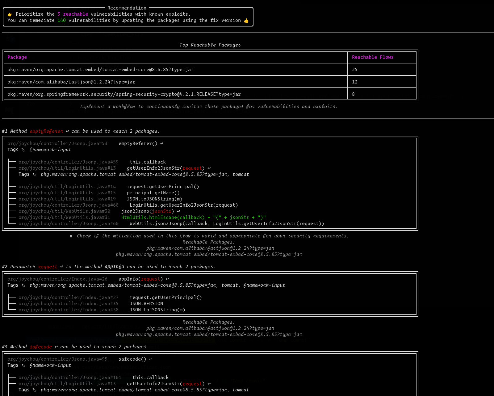
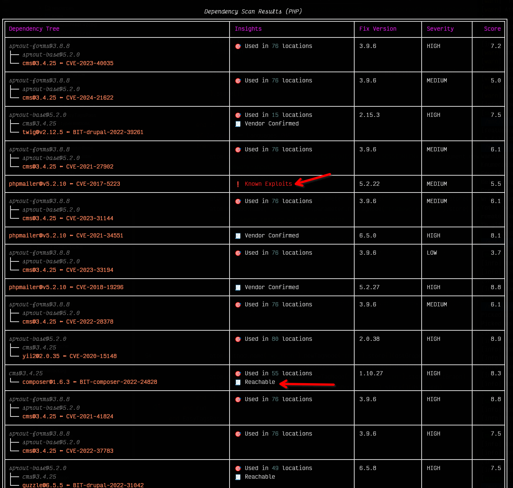
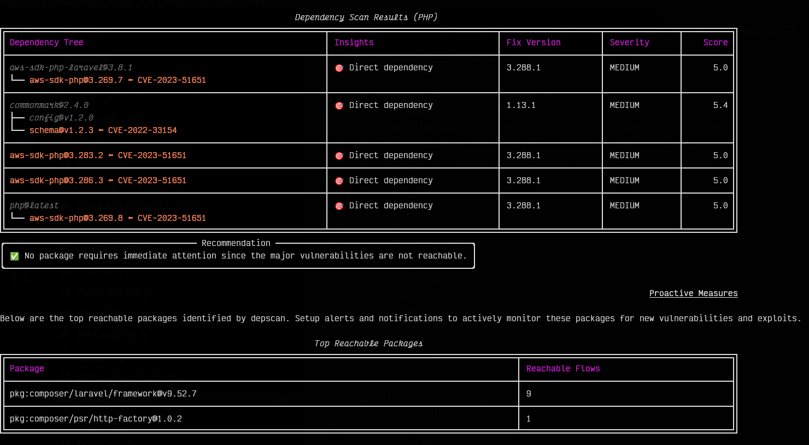

# Introduction

OWASP dep-scan is a next-generation security and risk audit tool based on known vulnerabilities, advisories, and license limitations for project dependencies. Both local repositories and container images are supported as the input, and the tool is ideal for integration with ASPM/VM platforms and in CI environments.


[](https://github.com/owasp-dep-scan/dep-scan/actions/workflows/pythonpublish.yml)
[](https://discord.gg/pF4BYWEJcS)

## Contents

-   [Features](#features)
    -   [Vulnerability Data sources](#vulnerability-data-sources)
    -   [Linux distros](#linux-distros)
-   [Usage](#usage)
    -   [OCI Artifacts via ORAS cli](#oci-artifacts-via-oras-cli)
    -   [Single binary executables](#single-binary-executables)
    -   [Server mode](#server-mode)
    -   [Scanning projects locally (Python version)](#scanning-projects-locally-python-version)
    -   [Scanning containers locally (Python version)](#scanning-containers-locally-python-version)
    -   [Scanning projects locally (Docker container)](#scanning-projects-locally-docker-container)
-   [Supported languages and package format](#supported-languages-and-package-format)
-   [Reachability analysis](#reachability-analysis)
    -   [Example analysis for a Java project](#example-analysis-for-a-java-project)
    -   [Example analysis for a JavaScript project](#example-analysis-for-a-javascript-project)
-   [Customization through environment variables](#customization-through-environment-variables)
-   [GitHub Security Advisory](#github-security-advisory)
-   [Suggest mode](#suggest-mode)
-   [Package Risk audit](#package-risk-audit)
    -   [Automatic adjustment](#automatic-adjustment)
    -   [Configuring weights](#configuring-weights)
-   [Live OS scan](#live-os-scan)
-   [License scan](#license-scan)
-   [Kubernetes and Cloud apps](#kubernetes-and-cloud-apps)
-   [PDF reports](#pdf-reports)
-   [Custom reports](#custom-reports)
-   [Performance tuning](#performance-tuning)
    -   [Use nydus to speed up the initial vdb download](#use-nydus-to-speed-up-the-initial-vdb-download)
-   [Discord support](#discord-support)
-   [License](#license)

## Features

-   Scan most application code - local repos, Linux container images, Kubernetes manifests, and OS - to identify known CVEs with prioritization
-   Perform advanced reachability analysis for multiple languages (See reachability analysis)
-   Package vulnerability scanning is performed locally and is quite fast. No server is used!
-   Generate Software Bill-of-Materials (SBOM) with Vulnerability Disclosure Report (VDR) information
-   Generate a Common Security Advisory Framework (CSAF) 2.0 VEX document (check out the [CSAF Readme](contrib/CSAF_README.md))
-   Perform deep packages risk audit for dependency confusion attacks and maintenance risks (See risk audit)




### Vulnerability Data sources

-   OSV
-   NVD
-   GitHub
-   NPM
-   Linux [vuln-list](https://github.com/appthreat/vuln-list)

### Linux distros

-   AlmaLinux
-   Debian
-   Alpine
-   Amazon Linux
-   Arch Linux
-   RHEL/CentOS
-   Rocky Linux
-   Ubuntu
-   OpenSUSE/SLES
-   Photon
-   Chainguard
-   Wolfi OS

Application vulnerabilities would be reported for all Linux distros and Windows. To download the full vulnerability database suitable for scanning OS, invoke dep-scan with `--cache` for the first time. dep-scan would also download the appropriate database based on project type automatically.

## Usage

dep-scan is ideal for use during continuous integration (CI) and as a local development tool.

### OCI Artifacts via ORAS cli

Use [ORAS cli](https://oras.land/docs/) to download the vulnerability database for effortless integration. Example workflow is [here](https://github.com/owasp-dep-scan/dep-scan/blob/master/.github/workflows/gobintests.yml#L44-L53).

```bash
export VDB_HOME=depscan
mkdir -p $VDB_HOME
oras pull ghcr.io/appthreat/vdb:v5 -o $VDB_HOME
# oras pull ghcr.io/appthreat/vdb-10y:v5 -o $VDB_HOME
oras pull ghcr.io/owasp-dep-scan/depscan:v4 -o $VDB_HOME
```

Use `vdb-10y` which is a larger database with vulnerability data spanning the last 10 years from 2014. In contrast, vdb with a starting year of 2018 is appropriate for most users.

### Single binary executables

Download the executable binary for your operating system from the [releases page](https://github.com/owasp-dep-scan/depscan-bin/releases). These binary bundle the following:

-   dep-scan with Python 3.11
-   cdxgen with Node.js 21
-   cdxgen binary plugins

```bash
curl -LO https://github.com/owasp-dep-scan/depscan-bin/releases/latest/download/depscan-linux-amd64
chmod +x depscan-linux-amd64
./depscan-linux-amd64 --help
```

On Windows,

```powershell
curl -LO https://github.com/owasp-dep-scan/depscan-bin/releases/latest/download/depscan.exe
.\depscan.exe --help
```

### Server mode

dep-scan and cdxgen could be run in server mode. Use the included docker-compose file to get started.

```bash
git clone https://github.com/owasp-dep-scan/dep-scan
docker compose up
```

```bash
depscan --server --server-host 0.0.0.0 --server-port 7070
```

In server mode, use `/cache` endpoint to cache the vulnerability database.

```bash
# This would take over 5 minutes
curl http://0.0.0.0:7070/cache
```

Use the `/scan` endpoint to perform scans.

> [!NOTE]
> The `type` parameter is mandatory in server mode.

-   Scanning a local directory.

```bash
curl --json '{"path": "/tmp/vulnerable-aws-koa-app", "type": "js"}' http://0.0.0.0:7070/scan
```

-   Scanning a SBOM file (present locally).

```bash
curl --json '{"path": "/tmp/vulnerable-aws-koa-app/sbom_file.json", "type": "js"}' http://0.0.0.0:7070/scan
```

-   Scanning a GitHub repo.

```bash
curl --json '{"url": "https://github.com/HooliCorp/vulnerable-aws-koa-app", "type": "js"}' http://0.0.0.0:7070/scan -o app.vdr.json
```

-   Uploading a SBOM file and generating results based on it.

```bash
curl -X POST -H 'Content-Type: multipart/form-data' -F 'file=@/tmp/app/sbom_file.json' http://0.0.0.0:7070/scan?type=js
```

### Scanning projects locally (Python version)

```bash
sudo npm install -g @cyclonedx/cdxgen
pip install owasp-depscan
```

This would install two commands called `cdxgen` and `depscan`.

You can invoke the scan command directly with the various options.

```bash
cd <project to scan>
depscan --src $PWD --reports-dir $PWD/reports
```

The full list of options is below:

```bash
usage: cli.py [-h] [--no-banner] [--cache] [--csaf] [--sync] [--profile {appsec,research,operational,threat-modeling,license-compliance,generic}] [--no-suggest] [--risk-audit] [--private-ns PRIVATE_NS] [-t PROJECT_TYPE] [--bom BOM]
              [-i SRC_DIR_IMAGE] [-o REPORT_FILE] [--reports-dir REPORTS_DIR] [--report-template REPORT_TEMPLATE] [--report-name REPORT_NAME] [--no-error] [--no-license-scan] [--deep] [--no-universal] [--no-vuln-table]
              [--threatdb-server THREATDB_SERVER] [--threatdb-username THREATDB_USERNAME] [--threatdb-password THREATDB_PASSWORD] [--threatdb-token THREATDB_TOKEN] [--server] [--server-host SERVER_HOST] [--server-port SERVER_PORT]
              [--cdxgen-server CDXGEN_SERVER] [--debug] [--explain] [--reachables-slices-file REACHABLES_SLICES_FILE] [-v]

Fully open-source security and license audit for application dependencies and container images based on known vulnerabilities and advisories.

options:
  -h, --help            show this help message and exit
  --no-banner           Do not display banner
  --cache               Cache vulnerability information in platform specific user_data_dir
  --csaf                Generate a OASIS CSAF VEX document
  --sync                Sync to receive the latest vulnerability data. Should have invoked cache first.
  --profile {appsec,research,operational,threat-modeling,license-compliance,generic}
                        Profile to use while generating the BOM.
  --no-suggest          Disable suggest mode
  --risk-audit          Perform package risk audit (slow operation). Npm only.
  --private-ns PRIVATE_NS
                        Private namespace to use while performing oss risk audit. Private packages should not be available in public registries by default. Comma separated values accepted.
  -t PROJECT_TYPE, --type PROJECT_TYPE
                        Override project type if auto-detection is incorrect
  --bom BOM             Examine using the given Software Bill-of-Materials (SBOM) file in CycloneDX format. Use cdxgen command to produce one.
  -i SRC_DIR_IMAGE, --src SRC_DIR_IMAGE
                        Source directory or container image or binary file
  -o REPORT_FILE, --report_file REPORT_FILE
                        DEPRECATED. Use reports directory since multiple files are created. Report filename with directory
  --reports-dir REPORTS_DIR
                        Reports directory
  --report-template REPORT_TEMPLATE
                        Jinja template file used for rendering a custom report
  --report-name REPORT_NAME
                        Filename of the custom report written to the --reports-dir
  --no-error            UNUSED: Continue on error to prevent build from breaking
  --no-license-scan     UNUSED: dep-scan doesn't perform license scanning by default
  --deep                Perform deep scan by passing this --deep argument to cdxgen. Useful while scanning docker images and OS packages.
  --no-universal        Depscan would attempt to perform a single universal scan instead of individual scans per language type.
  --no-vuln-table       Do not print the table with the full list of vulnerabilities. This can help reduce console output.
  --threatdb-server THREATDB_SERVER
                        ThreatDB server url. Eg: https://api.sbom.cx
  --threatdb-username THREATDB_USERNAME
                        ThreatDB username
  --threatdb-password THREATDB_PASSWORD
                        ThreatDB password
  --threatdb-token THREATDB_TOKEN
                        ThreatDB token for token based submission
  --server              Run depscan as a server
  --server-host SERVER_HOST
                        depscan server host
  --server-port SERVER_PORT
                        depscan server port
  --cdxgen-server CDXGEN_SERVER
                        cdxgen server url. Eg: http://cdxgen:9090
  --debug               Run depscan in debug mode.
  --explain             Makes depscan to explain the various analysis. Useful for creating detailed reports.
  --reachables-slices-file REACHABLES_SLICES_FILE
                        Path for the reachables slices file created by atom.
  --purl SEARCH_PURL    Scan a single package url.
  -v, --version         Display the version
```

### Scanning containers locally (Python version)

Scan `latest` tag of the container `shiftleft/scan-slim`

```bash
depscan --cache --src shiftleft/scan-slim -o containertests/depscan-scan.json -t docker
```

Include `license` to the type to perform the license audit.

```bash
depscan --cache --src shiftleft/scan-slim -o containertests/depscan-scan.json -t docker,license
```

You can also specify the image using the sha256 digest

```bash
depscan --src redmine@sha256:a5c5f8a64a0d9a436a0a6941bc3fb156be0c89996add834fe33b66ebeed2439e -o containertests/depscan-redmine.json -t docker
```

You can also save container images using docker or podman save command and pass the archive to depscan for scanning.

```bash
docker save -o /tmp/scanslim.tar shiftleft/scan-slim:latest
# podman save --format oci-archive -o /tmp/scanslim.tar shiftleft/scan-slim:latest
depscan --src /tmp/scanslim.tar -o reports/depscan-scan.json -t docker
```

Refer to the docker tests under the GitHub action workflow for this repo for more examples.

### Scanning projects locally (Docker container)

`ghcr.io/owasp-dep-scan/dep-scan` container image can be used to perform the scan.

To scan with default settings

```bash
docker run --rm -v $PWD:/app ghcr.io/owasp-dep-scan/dep-scan --src /app --reports-dir /app/reports
```

To scan with custom environment variables based configuration

```bash
docker run --rm \
    -e VDB_HOME=/db \
    -e GITHUB_TOKEN=<token> \
    -v /tmp:/db \
    -v $PWD:/app ghcr.io/owasp-dep-scan/dep-scan --src /app --reports-dir /app/reports
```

In the above example, `/tmp` is mounted as `/db` into the container. This directory is then specified as `VDB_HOME` for caching the vulnerability information. This way the database can be cached and reused to improve performance.

## Supported languages and package format

dep-scan uses [cdxgen](https://github.com/CycloneDX/cdxgen) command internally to create a Software Bill-of-Materials (SBOM) file for the project. This is then used for performing the scans.

The following projects and package-dependency format is supported by cdxgen.

| Language                 | Package format                                                                          |
| ------------------------ | --------------------------------------------------------------------------------------- |
| node.js                  | package-lock.json, pnpm-lock.yaml, yarn.lock, rush.js, bower.json, .min.js              |
| java                     | maven (pom.xml [1]), gradle (build.gradle, .kts), scala (sbt), bazel                    |
| php                      | composer.lock                                                                           |
| python                   | setup.py, requirements.txt [2], Pipfile.lock, poetry.lock, bdist_wheel, .whl, .egg-info |
| go                       | binary, go.mod, go.sum, Gopkg.lock                                                      |
| ruby                     | Gemfile.lock, gemspec                                                                   |
| rust                     | binary, Cargo.toml, Cargo.lock                                                          |
| .Net                     | .csproj, packages.config, project.assets.json [3], packages.lock.json, .nupkg           |
| dart                     | pubspec.lock, pubspec.yaml                                                              |
| haskell                  | cabal.project.freeze                                                                    |
| elixir                   | mix.lock                                                                                |
| c/c++                    | conan.lock, conanfile.txt                                                               |
| clojure                  | Clojure CLI (deps.edn), Leiningen (project.clj)                                         |
| docker / oci image       | All supported languages and Linux OS packages                                           |
| GitHub Actions Workflows | .github/workflows/\*.yml                                                                |
| Jenkins Plugins          | .hpi files                                                                              |
| YAML manifests           | docker-compose, kubernetes, kustomization, skaffold, tekton etc                         |

## Reachability analysis

Depscan can perform reachability analysis for Java, JavaScript, TypeScript and Python with built-in support for parsing [atom](https://github.com/AppThreat/atom) reachables slicing. Simply invoke depscan with the `research` profile and language type to enable this feature.

To receive a verbose output including the reachable flows, pass the argument `--explain`

```shell
--profile research -t language [--explain]
```

### Example analysis for a Java project

```shell
depscan --profile research -t java -i <source directory> --reports-dir <reports directory> --explain
```

### Example analysis for a JavaScript project

```shell
depscan --profile research -t js -i <source directory> --reports-dir <reports directory> --explain
```

### Example analysis for a PHP project

Ensure PHP > 7.4 is installed. However, we support scanning PHP 5.2 - 8.3. Alternatively, use the depscan container image.

```shell
depscan --profile research -t php -i <source directory> --reports-dir <reports directory> --explain
```





## Customization through environment variables

The following environment variables can be used to customize the behavior.

-   VDB_HOME - Directory to use for caching database. For docker-based execution, this directory should get mounted as a volume from the host
-   VDB_DATABASE_URL - Vulnerability DB URL. Defaults to: ghcr.io/appthreat/vdbgz:v5
-   USE_VDB_10Y - Set to true to use the larger 10-year vulnerability database. Default download url: ghcr.io/appthreat/vdb-10y:v5

## GitHub Security Advisory

To download security advisories from GitHub, a personal access token with minimal permissions is necessary.

-   Fine-grained token: Grant no permissions and select the following for repository access: `Public Repositories (read-only)`
-   Token (classic): Grant no permissions

```bash
export GITHUB_TOKEN="<PAT token>"
```

## Suggest mode

Depscan comes with a suggest mode enabled by default to simplify the triaging experience. The fix version for each vulnerability is retrieved from the sources. Sometimes, there might be known vulnerabilities in the fix version reported. Eg: in the below screenshot the fix versions suggested for jackson-databind might contain known vulnerabilities.


Notice, how the new suggested version is `2.9.10.5` which is an optimal fix version. Please note that the optimal fix version may not be the appropriate version for your application based on compatibility.

Pass `--no-suggest` to disable this behavior.

## Package Risk audit

`--risk-audit` argument enables package risk audit. Currently, only npm and PyPI packages are supported in this mode. Some risk factors are identified and assigned weights to compute a final risk score. Packages that then exceed a maximum risk score (`config.pkg_max_risk_score`) are presented in a table.

Use `--private-ns` to specify the private package namespace that should be checked for dependency confusion type issues where a private package is available on the public npm/pypi registry.

For example, to check if private packages with namespaces @appthreat and @shiftleft are not accidentally made public, use the below argument.

```
--private-ns appthreat,shiftleft
```

| Risk category                  | Default Weight | Reason                                                                                                                                                                                                     |
| ------------------------------ | -------------- | ---------------------------------------------------------------------------------------------------------------------------------------------------------------------------------------------------------- |
| pkg_private_on_public_registry | 4              | Private package is available on a public registry                                                                                                                                                          |
| pkg_min_versions               | 2              | Packages with less than 3 versions represent an extreme where they could be either super stable or quite recent. Special heuristics are applied to ignore older stable packages                            |
| mod_create_min_seconds         | 1              | Less than 12 hours difference between modified and creation time. This indicates that the upload had a defect that had to be rectified immediately. Sometimes, such a rapid update could also be malicious |
| latest_now_min_seconds         | 0.5            | Less than 12 hours difference between the latest version and the current time. Depending on the package such a latest version may or may not be desirable                                                  |
| latest_now_max_seconds         | 0.5            | Package versions that are over 6 years old are in use. Such packages might have vulnerable dependencies that are known or yet to be found                                                                  |
| pkg_min_maintainers            | 2              | Package has less than 2 maintainers. Many opensource projects have only 1 or 2 maintainers so special heuristics are used to ignore older stable packages                                                  |
| pkg_min_users                  | 0.25           | Package has less than 2 npm users                                                                                                                                                                          |
| pkg_install_scripts            | 2              | Package runs a custom pre or post installation scripts. This is often malicious and a downside of npm.                                                                                                     |
| pkg_node_version               | 0.5            | Package supports outdated version of node such as 0.8, 0.10, 4 or 6.x. Such projects might have prototype pollution or closure related vulnerabilities                                                     |
| pkg_scope                      | 4 or 0.5       | Packages that are used directly in the application (required scope) gets a score with a weight of 4. Optional packages get a score of 0.25                                                                 |
| deprecated                     | 1              | Latest version is deprecated                                                                                                                                                                               |

Refer to `pkg_query.py::get_category_score` method for the risk formula.

### Automatic adjustment

A parameter called `created_now_quarantine_seconds` is used to identify packages that are safely past the quarantine period (1 year). Certain risks such as `pkg_min_versions` and `pkg_min_maintainers` are suppressed for packages past the quarantine period. This adjustment helps reduce noise since it is unlikely that a malicious package can exist in a registry unnoticed for over a year.

### Configuring weights

All parameters can be customized by using environment variables. For eg:

export PKG_MIN_VERSIONS=4 to increase and set the minimum versions category to 4.

## Live OS scan

By passing `-t os`, depscan can generate an SBOM for a live operating system or a VM with OS packages and kernel information. Optionally, pass the argument `--deep` to generate an SBOM with both OS and application packages and to check for application vulnerabilities.

All OS packages.

```bash
depscan -t os -i . -o reports/depscan.json
```

All OS and application packages.

```bash
depscan -t os --deep -i . -o reports/depscan.json
```

## License scan

dep-scan can scan the dependencies for any license limitations and report them directly on the console log. To enable license scanning set the environment variable `FETCH_LICENSE` to `true`.

```
export FETCH_LICENSE=true
```

The license data is sourced from choosealicense.com and is quite limited. If the license of a given package cannot be reliably matched against this list it will get silently ignored to reduce any noise. This behavior could change in the future once the detection logic gets improved.


## Kubernetes and Cloud apps

dep-scan could auto-detect most cloud applications and Kubernetes manifest files. Pass the argument `-t yaml-manifest` to manually specify the type.

## PDF reports

Ensure [wkhtmltopdf](https://wkhtmltopdf.org/downloads.html) is installed or use the official container image to generate pdf reports. Use with `--explain` for more detailed reports.

## Custom reports

dep-scan can be provided with a [Jinja](https://jinja.palletsprojects.com/en/3.1.x/) template using the `--report-template` parameter.
Giving it will pass the vulnerability report into your template for rendering the report.

Please find a basic example here:

```jinja

Report for {{ metadata.component.group }}:{{ metadata.component.name }}:{{ metadata.component.version }}



There were {{ vulnerabilities | length }} issues identified:


* {{ vuln['bom-ref'] }} - {{ vuln.recommendation }}


🏆 _No vulnerabilities found_


Severity counts:
* Low: {{ summary.LOW }}
* Medium: {{ summary.MEDIUM }}
* High: {{ summary.HIGH }}
* Critical: {{ summary.CRITICAL }}
* Unspecified: {{ summary.UNSPECIFIED }}
```

The objects available are taken from the CycloneDX \*.vdr.json BOM file generated, just have a look at the file for its full structure:

-   `metadata`
-   `vulnerabilities`
-   `components`
-   `dependencies`
-   `services`

`summary` is a dictionary type with vulnerability severity quantities as shown in the example above.
`pkg_vulnerabilities` - Same as `vulnerabilities` from the VDR
`pkg_group_rows` - List of vulnerability id and the dependency tree prioritized by depscan.

Furthermore, insights are imaginable to be made available to the template, please reach out or contribute on demand.
We appreciate it if you like to contribute your report templates as examples, please add/find them [here](contrib/report-templates/).

## Performance tuning

### Use nydus to speed up the initial vdb download

vdb v5 is published in RAFS (Registry Accelerated File System) format with better de-duplication and packing. depscan would automatically use this image if `nydus-static` binary is available in the PATH.

```shell
curl -LO https://github.com/dragonflyoss/nydus/releases/download/v2.2.4/nydus-static-v2.2.4-linux-amd64.tgz
tar -xvf nydus-static-v2.2.4-linux-amd64.tgz
chmod +x nydus-static/*
mv nydus-static/* /usr/local/bin/
```

## Discord support

The developers could be reached via the [discord](https://discord.gg/DCNxzaeUpd) channel for enterprise support.

## License

MIT License

This project was donated to the OWASP Foundation in August 2023 by AppThreat Ltd.
